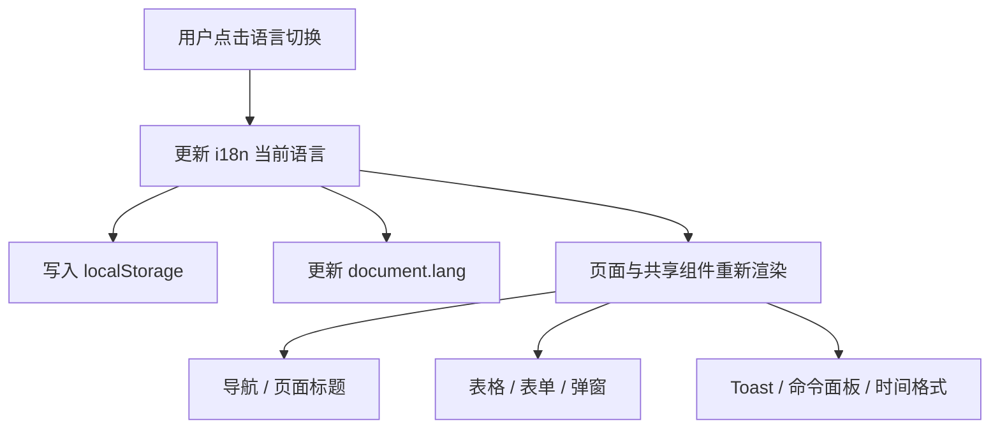

# Dashboard 中英文界面支持需求

## 文档目标

本文档整理当前会话中提出的 Dashboard 中英文支持需求，作为后续开发、验收和回归测试的统一依据。

## 背景

当前 Daytona Lite Dashboard 以英文界面为主。需要在不改动后端 API 协议的前提下，为前端管理界面补齐中英文切换能力，并确保各业务模块在切换后能够即时展示对应语言。

## 目标

- Dashboard 前端支持 `zh-CN` 与 `en` 两种界面语言。
- 默认界面语言为中文。
- 用户切换语言后，刷新页面仍保持上次选择。
- 所有前端可控文案应随语言切换即时生效。
- 语言切换入口应在已登录与未登录页面均可访问。

## 非目标

- 不修改任何后端 API、OpenAPI 协议或鉴权协议。
- 不翻译后端直接返回的原始错误 `message`。
- 不翻译代码示例、命令示例、URL、Token、镜像标签、资源单位（如 `GiB`、`vCPU`）。
- 不引入新的测试框架。

## 范围

### 包含范围

- `apps/dashboard` 前端所有用户可见页面。
- 共享 UI 组件中的按钮、表单、弹窗、表格、空状态、分页、命令面板等前端字面量。
- 语言切换状态持久化、HTML `lang` 同步、日期时间展示本地化。

### 重点模块

- 登录页、回调页、404 页面。
- 侧边栏、左下角主题/语言切换、组织切换菜单。
- Sandboxes 模块。
- Snapshots 模块。
- API Keys、Limits、Settings、Account Settings。
- Command Palette。
- Toast、批量操作提示、复制提示、空状态提示。

## 功能需求

### 1. 国际化基础设施

1. 前端引入统一 i18n 层，语言类型固定为 `zh-CN | en`。
2. 默认语言为 `zh-CN`。
3. 若本地存储存在用户已选语言，则优先使用已保存值。
4. 语言切换后必须同步更新 `document.documentElement.lang`。
5. 语言选择必须写入本地存储并在刷新后生效。

### 2. 语言切换入口

1. Dashboard 主切换入口放在左下角 `Sidebar` footer。
2. 切换按钮为单击切换，在 `中文` 与 `EN` 间即时切换。
3. 侧边栏展开态显示语言名称，折叠态保留图标和 tooltip。
4. 登录页、404、回调页等无 Sidebar 页面也必须提供轻量语言切换入口。
5. 左下角语言切换按钮与主题切换按钮的视觉布局必须对齐。

### 3. 文案覆盖要求

1. 页面标题、导航、按钮、表单标签、placeholder、帮助文案必须支持中英文切换。
2. 表格列名、筛选器、排序文案、分页文案、空状态文案必须支持中英文切换。
3. Dialog、AlertDialog、Sheet、Dropdown、Popover 等弹出层文案必须支持中英文切换。
4. Command Palette 的标题、搜索框、分组名称、命令标签必须支持中英文切换。
5. Toast、批量操作进度、成功/失败/取消提示必须支持中英文切换。
6. 相对时间、日期时间展示、数字展示必须跟随当前语言。

### 4. Sandboxes 模块专项要求

1. 点击左侧 `Sandboxes` 菜单后，列表页、筛选器、批量操作、详情抽屉、SSH/VNC/录屏相关提示必须全部完成中英文切换。
2. Sandboxes 页面右上角的 `Onboarding guide` 与 `Docs` 必须移除。
3. Sandboxes 页面中不得残留英文表格列名、筛选器名称、弹窗标题或按钮文本。

### 5. Snapshots 模块专项要求

1. 点击左侧 `Snapshots` 菜单后，列表页表头、状态列、创建按钮、空状态、批量操作文案必须支持中英文切换。
2. `Create Snapshot` 按钮必须随语言切换展示中文或英文。
3. `Name`、`State`、`Created`、`Last Used` 等表头必须随语言切换展示中文或英文。
4. 快照状态标签与操作菜单必须支持中英文切换。

### 6. 组织切换专项要求

1. 侧边栏顶部组织切换菜单中的 `Personal` 必须支持中英文切换。
2. 组织切换菜单中的 `Create Organization` 必须支持中英文切换。
3. 组织切换相关命令面板项与复制组织 ID 提示应支持中英文切换。

## 兼容性与交互要求

- 切换语言后不需要手动刷新页面。
- 已打开的页面、表格、弹窗应尽量即时更新为目标语言。
- 主题切换、组织切换、路由跳转、查询参数和现有权限控制逻辑不得受影响。
- 页面在桌面端和移动端都应保持可用。

## 页面与组件关系

## 验收标准

### 通用验收

1. 首次进入 Dashboard，默认显示中文。
2. 手动切到英文后刷新页面，仍保持英文。
3. 再切回中文后，界面可即时恢复中文，不需刷新。

### 页面级验收

1. 登录页、404、回调页在未登录状态可切换语言。
2. Sidebar 左下角主题切换与语言切换按钮视觉对齐。
3. 组织切换菜单中的个人组织与创建组织入口语言正确。
4. Sandboxes 模块列表、筛选器、弹窗、详情抽屉无残留英文。
5. Snapshots 模块表头、状态、创建按钮无残留英文。

### 提示与格式化验收

1. Toast、批量操作提示、复制成功/失败提示语言正确。
2. 相对时间与日期时间格式跟随语言变化。
3. 不应出现切到中文后仍保留英文缩写提示的情况。

## 回归关注点

- Command Palette 注册项是否会在切换语言后即时更新。
- Sidebar 折叠与展开状态下语言切换按钮是否都可用。
- 共享 UI 组件中的字面量翻译是否影响原有交互。
- 构建、lint 与现有页面路由是否保持正常。

## 实施说明

推荐按以下顺序落地：

1. 建立前端 i18n 基础设施与语言持久化。
2. 接入 Sidebar、未登录页面和共享组件。
3. 逐模块补齐 Sandboxes、Snapshots、Settings 等业务页面。
4. 对遗漏文案进行回归修正。
5. 通过构建、lint 和关键路径手测完成验收。
