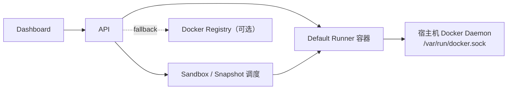
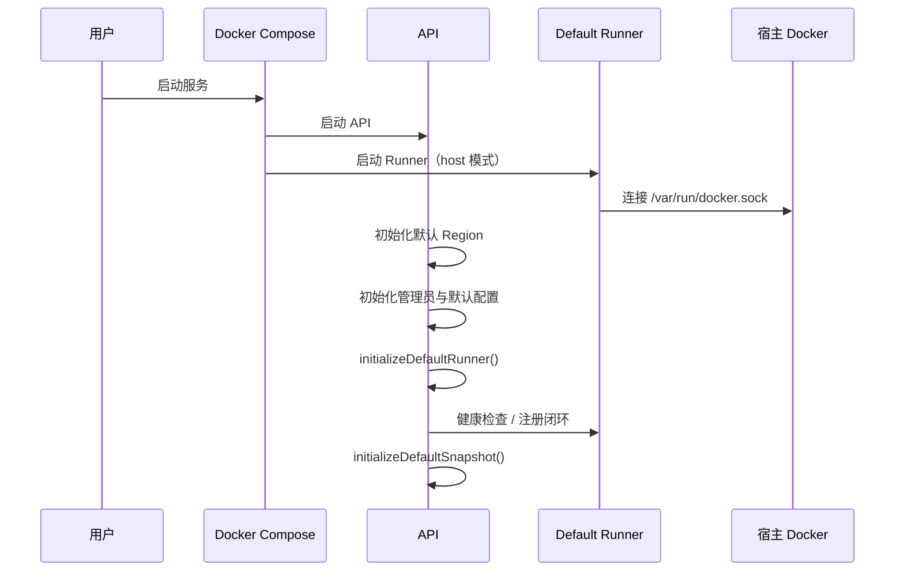
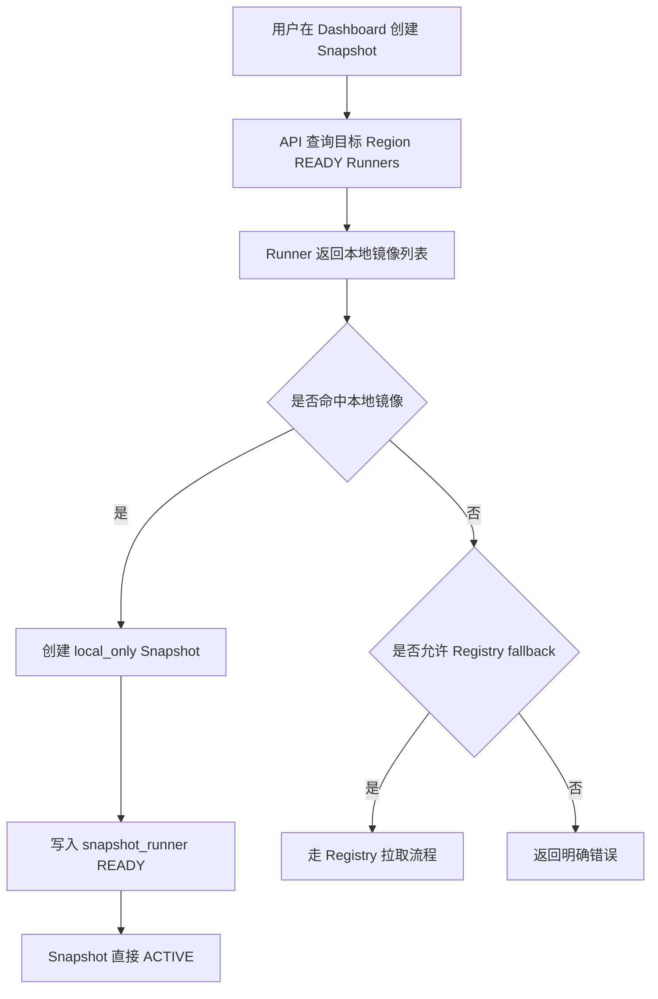
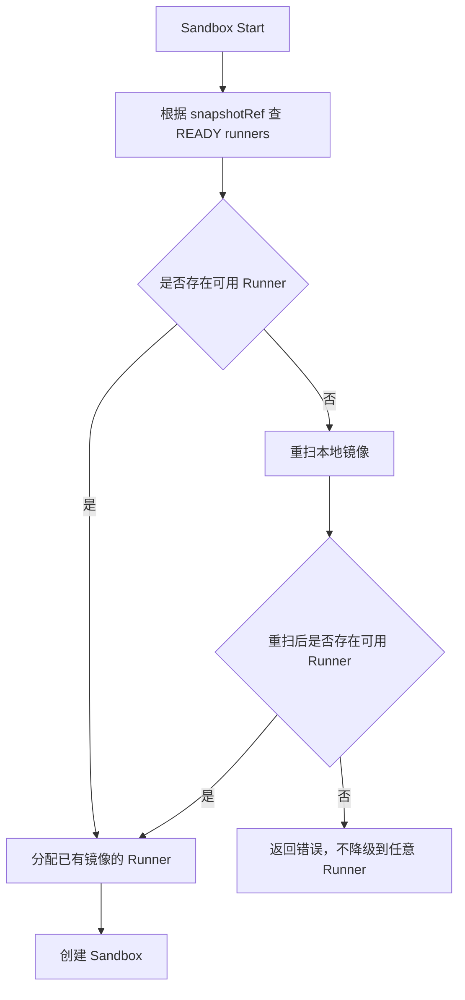

# 本地镜像优先与默认 Runner 自动接入

## 文档目标

本文档描述 Daytona Lite 在私有化和本机部署场景下的默认运行方式调整：

- 默认直接使用当前机器上的本地 Docker images
- 默认将当前机器自动接入为一个可用 Runner
- Docker Registry 从默认前置依赖调整为可选扩展能力

该方案的目标是降低初始化成本，让服务在没有额外 Registry 配置的情况下也能完成镜像发现、Snapshot 创建、Sandbox 调度与启动。

## 背景

传统流程默认依赖 Docker Registry：

1. 需要先注册一个可用 Registry
2. Snapshot 拉取和构建结果默认需要经过 Registry 分发
3. 在私有化、单机或快速试用场景下，初始化步骤偏多

这会带来几个问题：

- 本机已有 Docker 镜像时，无法直接复用
- 首次部署必须理解并配置 Registry 相关概念
- Runner 的可用性依赖额外基础设施完成

## 目标

### 业务目标

- 极致快速地启动服务
- 极致快速地拉起完整运行链路
- 最大程度降低初始化配置门槛
- 支持在未注册 Docker Registry 的前提下扫描和启动本地镜像

### 默认行为目标

- 默认部署方式为“本机即默认 Runner”
- 默认镜像来源为本地 Docker images
- 默认支持本地镜像扫描
- Registry 仅作为可选扩展

### 可选扩展目标

Registry 继续保留以下用途：

- 私有镜像仓库认证
- 跨 Runner 镜像分发
- 备份与恢复链路

## 非目标

- 不改变备份恢复默认仍依赖 backup registry 的事实
- 不引入新的长期同步服务去持续同步本地镜像索引
- 不取消 Registry 相关能力，只调整其默认角色

## 默认部署模型

### 核心原则

- API 默认自动创建本机对应的 Runner 记录
- Runner 默认作为独立容器运行
- Runner 默认挂载宿主机 Docker Socket
- Runner 默认不再启动 dind

### 默认拓扑



### 启动时序



## 镜像来源策略

### 默认策略

系统默认采用“本地镜像优先，Registry 回退”的镜像获取策略。

优先级如下：

1. 扫描目标 Region 内 READY Runner 的本地镜像
2. 如果找到匹配镜像，直接创建 `local_only` Snapshot
3. 如果本地不存在，且启用了 Registry fallback，则走 Registry 路径
4. 如果两者都不可用，明确报错

### Snapshot 来源与存储模式

新增两个维度：

| 字段 | 含义 | 值 |
| --- | --- | --- |
| `sourceType` | Snapshot 来源 | `local_image` / `registry_image` / `build` |
| `storageMode` | Snapshot 分发模式 | `local_only` / `registry` |

### 行为解释

| 场景 | sourceType | storageMode | 说明 |
| --- | --- | --- | --- |
| 直接命中本地镜像 | `local_image` | `local_only` | 不依赖 Registry |
| 从 Registry 拉取镜像 | `registry_image` | `registry` | 保留现有分发能力 |
| Dockerfile 构建且无 internal registry | `build` | `local_only` | 结果仅落在本地 Runner |
| Dockerfile 构建且有 internal registry | `build` | `registry` | 维持现有分发链路 |

## Runner 自动接入

### 设计原则

- 本机自动接入 Runner 采用“默认 Runner 容器”实现
- 不采用 API 内嵌 Runner
- 不要求用户手动创建第一台 Runner

### 自动注册逻辑

API 启动后会执行默认 Runner 初始化逻辑：

- 当 `AUTO_REGISTER_LOCAL_RUNNER=true` 时执行
- 默认 Runner 的 `apiUrl`、`proxyUrl`、`domain` 使用默认容器配置
- Runner 健康检查成功后进入可用状态

### 结果

启动完成后，默认应具备以下状态：

- 至少存在一个默认 Region
- 至少存在一个默认 Runner
- 默认 Runner 能直接看到宿主机已有 Docker 镜像

## 本地镜像扫描

### Runner 侧能力

Runner 增加本地镜像只读接口：

```http
GET /images/local?q=<query>
```

返回字段：

- `imageName`
- `repoTags`
- `repoDigests`
- `sizeGB`
- `entrypoint`
- `cmd`

### API 侧聚合能力

API 增加聚合接口：

```http
GET /snapshots/local-images?regionId=<id>&q=<query>&refresh=<bool>
```

行为如下：

- 扫描目标 Region 内 READY Runner
- 聚合同名镜像
- 返回镜像出现在哪些 Runner 上
- 使用短 TTL 缓存
- `refresh=true` 时强制重扫

返回字段：

- `imageName`
- `repoTags`
- `repoDigests`
- `sizeGB`
- `entrypoint`
- `cmd`
- `runnerIds`
- `runnerCount`

## Snapshot 创建逻辑

### Pull 型 Snapshot

创建流程如下：

1. 校验镜像名和 Snapshot 名称
2. 在目标 Region 内扫描 READY Runner 的本地镜像
3. 如果命中：
   - 创建 `sourceType=local_image`
   - 创建 `storageMode=local_only`
   - `snapshot.ref` 保存规范化镜像名
   - 为已有镜像的 Runner 建立 `snapshot_runner=READY`
   - 直接进入 `ACTIVE`
4. 如果未命中且允许 fallback：
   - 走现有 Registry 流程
   - 创建 `registry_image + registry`
5. 如果都不可用：
   - 返回明确错误

### Build 型 Snapshot

构建流程根据 internal registry 是否可用分两条：

- 有 internal registry：
  - 保留现有构建并推送 registry 的逻辑
- 无 internal registry：
  - 构建结果保留在本地
  - Snapshot 创建为 `build + local_only`

## 调度与运行限制

### local_only Snapshot 调度原则

- 只能调度到已经拥有该镜像的 Runner
- 不允许在没有镜像的 Runner 上兜底启动
- 不强制触发 Registry pull/push

### SnapshotManager 行为

对于 `local_only` Snapshot：

- 不再做 registry 分发
- 周期性重扫本地镜像可用性
- 维护 `snapshot_runner READY`
- 如果某 Runner 丢失镜像，对应 `snapshot_runner` 会被清理

### SandboxStartAction 行为

启动 Sandbox 时：

- 优先从已有 `snapshot_runner READY` 的 Runner 中选取
- 如果没有 READY Runner：
  - 先触发一次重扫
  - 仍无结果则报错
- 不会降级到任意 Runner

## 前端交互

### Snapshot 创建弹窗

默认交互调整为：

- 保留手动输入镜像名
- 默认展示本地镜像列表
- 支持按关键字搜索本地镜像
- 点击本地镜像后自动回填：
  - `imageName`
  - `entrypoint`
  - 可推导的默认 Snapshot 名称

### Snapshot 列表展示

列表中新增以下信息：

- `sourceType`
- `storageMode`

展示语义：

- `Local image`
- `Registry image`
- `Build`
- `Local only`
- `Registry distributed`

### Registries 页面文案

页面文案调整为“可选扩展”，不再暗示 Registry 是默认前置条件。

## 配置项

### API 侧

| 变量 | 默认值 | 说明 |
| --- | --- | --- |
| `LOCAL_IMAGE_MODE` | `true` | 启用本地镜像优先 |
| `LOCAL_IMAGE_SCAN_ENABLED` | `true` | 启用本地镜像扫描 |
| `REGISTRY_FALLBACK_ENABLED` | `true` | 本地找不到镜像时是否允许回退 Registry |
| `AUTO_REGISTER_LOCAL_RUNNER` | `true` | 自动注册默认 Runner |
| `ENABLE_DEFAULT_INTERNAL_REGISTRY` | `false` | 是否初始化默认 internal registry |
| `ENABLE_DEFAULT_TRANSIENT_REGISTRY` | `false` | 是否初始化默认 transient registry |
| `ENABLE_DEFAULT_BACKUP_REGISTRY` | `false` | 是否初始化默认 backup registry |
| `DEFAULT_RUNNER_DOCKER_MODE` | `host` | 默认 Runner 连接 Docker 的方式 |

### Runner 侧

| 变量 | 默认值 | 说明 |
| --- | --- | --- |
| `RUNNER_DOCKER_MODE` | `host` | `host` 或 `dind` |
| `DOCKER_HOST` | `unix:///var/run/docker.sock` | 宿主 Docker Socket |
| `RUNNER_AUTO_REGISTER` | `true` | 语义化开关，默认 Runner 场景使用 |
| `RUNNER_INSECURE_REGISTRIES` | 空 | 仅在 `dind` 模式下生效 |

## Docker Compose 调整

### 生产 Compose

默认行为：

- 启动 Runner 容器
- Runner 直接挂载宿主 Docker Socket
- API 默认启用本地镜像优先
- 内置 Registry 不再作为默认依赖

### 开发 Compose

默认行为：

- 开发依赖启动时默认包含 Runner
- Runner 默认使用宿主 Docker Socket
- Registry 放入可选 profile

示例：

```bash
docker compose -f docker/docker-compose.yaml up
docker compose -f docker/docker-compose.dev.yml up
docker compose -f docker/docker-compose.yaml --profile registry up
```

## 数据库变更

### Snapshot 表

新增字段：

- `sourceType`
- `storageMode`

### 历史数据回填

- 历史 build snapshot 回填为 `build + registry`
- 历史 pull snapshot 回填为 `registry_image + registry`

## 接口变更

### API

新增：

- `GET /snapshots/local-images`

扩展：

- `SnapshotDto.sourceType`
- `SnapshotDto.storageMode`
- `ConfigurationDto.localImageMode`
- `ConfigurationDto.localImageScanEnabled`
- `ConfigurationDto.registryFallbackEnabled`
- `ConfigurationDto.autoRegisterLocalRunner`

### Runner

新增：

- `GET /images/local`

### Adapter

新增方法：

```ts
listLocalImages(query?: string): Promise<LocalImage[]>
```

## 典型流程

### 场景一：本地已有镜像，直接创建 Snapshot



### 场景二：启动依赖 local_only Snapshot 的 Sandbox



## 运维与使用建议

### 推荐场景

- 单机部署
- 私有化测试环境
- 本地开发环境
- 已经通过 `docker pull` 或 `docker build` 准备好镜像的机器

### 前置条件

- 宿主机安装 Docker
- Runner 能访问 `/var/run/docker.sock`
- 默认 Runner 容器具备访问宿主 Docker daemon 的权限

### 何时仍建议配置 Registry

- 多 Runner 分发镜像
- 私有仓库鉴权
- 需要标准化备份恢复流程
- 需要跨机器共享构建结果

## 验收标准

### 部署验收

- 启动服务后默认存在一个 READY Runner
- 无需事先注册 Registry 也能完成基本启动

### 镜像验收

- 宿主机已有镜像时，Dashboard 能看到本地镜像列表
- 使用本地镜像创建 Snapshot 后，Snapshot 直接进入 `ACTIVE`

### 调度验收

- `local_only` Snapshot 只能调度到已有镜像的 Runner
- 镜像不存在时，不会错误地落到任意 Runner

### 兼容性验收

- 显式启用 Registry 后，原有 Registry 相关能力仍可继续使用

## 总结

这次调整后的核心原则是：

- 默认让系统“先跑起来”
- 默认直接复用当前机器已有 Docker 镜像
- 默认自动接入当前机器作为 Runner
- 将 Registry 从“默认前置依赖”调整为“可选扩展能力”

这使 Daytona Lite 更适合私有化、单机和快速验证场景，同时保留了多 Runner 与 Registry 分发能力的扩展空间。
